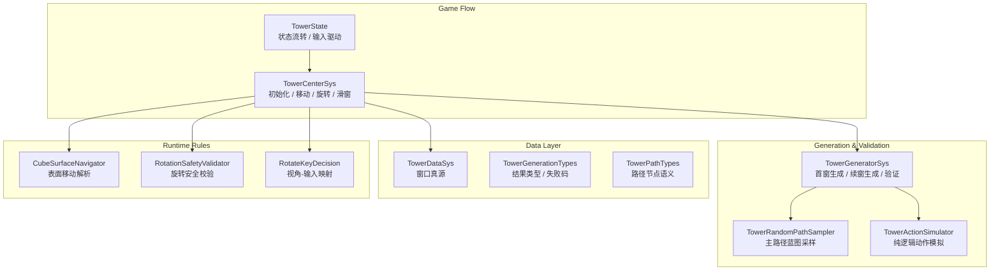
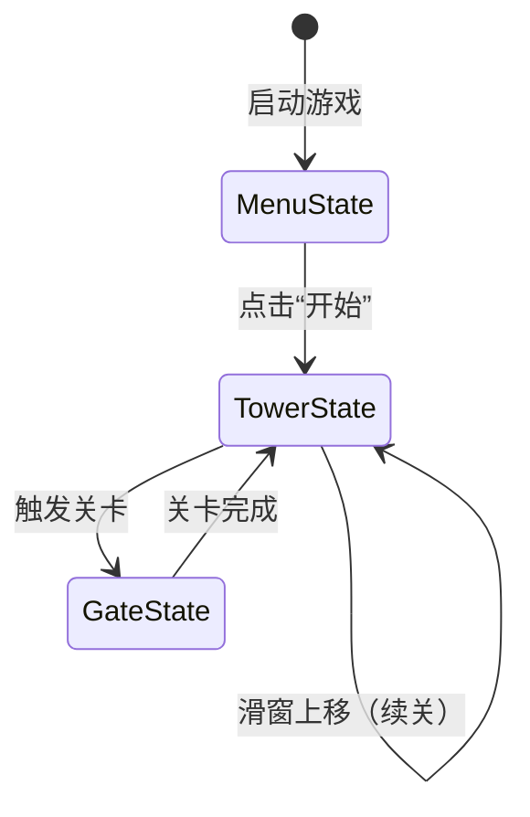

# Game Design Document: 交错空间 (InterwovenSpace)

> **版本纪要**: v1.0.1  
> **作者**: Game Designer  
> **引擎**: Unity (C#) + Luban 配置系统  
> **核心标签**: 3D空间旋转 / 解谜攀爬 / 无尽塔PCG / 心流DDA / AR交互(规划中)

---

## 1. 设计愿景与三大支柱 (Design Pillars)

### 🎯 Pillar 1 — 三维空间旋转解谜
区别于传统2D拼图，玩家需在脑中进行"心理旋转（Mental Rotation）"来推演旋转后的路径拼接结果。核心挑战来自**空间认知**而非反应速度，每一次成功拼接都带来强烈的"恍然大悟"成就感。

### 🎯 Pillar 2 — 无尽攀升的心流沉浸
基于反向打乱法（Backward Scrambling）的过程化内容生成，每局谜题**100%数学可解**。配合动态难度调整（DDA），系统始终将玩家锁定在"挑战与技能平衡"的心流通道中。

### 🎯 Pillar 3 — 具身认知的AR桥梁（规划中）
支持玩家使用实体魔方模型通过AR识别同步到数字环境，将抽象的"心理旋转"降级为具象的"物理旋转"，为空间焦虑的玩家提供**认知脚手架**。

---

## 2. 核心循环 (Core Gameplay Loop)

### 2.1 瞬时循环 (Moment-to-Moment: 5~30秒)
1. **观察场景**：审视当前3×3×3的方块布局，识别入口与出口
2. **心理旋转推演**：在脑中模拟面旋转后的路径变化
3. **执行面旋转**：对选定面施加90°旋转，拼接路径
4. **角色移动**：操控角色沿拼好的路径行走

### 2.2 窗口循环 (Window Loop: 3~10分钟)
1. **解谜**：通过旋转+移动，引导角色从底层入口到达顶层出口
2. **窗口上移**：到达顶层后触发滑窗，旧顶层继承为新底层
3. **新谜题展开**：系统自动生成新中层和顶层，下一轮解谜开始
4. **DDA调控**：根据本窗口的撤回率、停顿时间动态调整下一窗口难度

### 2.3 长线循环 (Meta Loop)
- **无尽攀升**：无终点的塔高度记录
- **关卡模式**：手工设计的精品关卡（GateState）提供教学与剧情推进
- **AR辅助**：物理魔方辅助理解空间关系（规划中）

---

## 3. 技术架构概览

### 3.1 系统架构图

### 3.2 核心模块清单

| 模块 | 文件 | 职责 |
| :--- | :--- | :--- |
| 塔状态流转 | TowerState.cs | 场景状态机、输入驱动 |
| 塔核心控制 | TowerCenterSys.cs | 初始化/移动/旋转/滑窗/运行时接线 |
| 塔生成器(编排) | TowerGeneratorSys.cs | 首窗/续窗生成编排器，委托子组件执行 |
| 规则提供者 | TowerPatternProvider.cs | Luban 三表规则解析、验证、Profile 构建 |
| 窗口构造器 | TowerWindowBuilder.cs | Cell 工厂、外围填充、采样、朝向辅助 |
| 路径验证器 | TowerRouteValidator.cs | 路径回放、可玩性准入、结构完整性校验 |
| 续窗投影器 | TowerContinuationProjector.cs | 顶层快照、续窗投影、现场捕获 |
| 塔数据真源 | TowerDataSys.cs | CurrentWindowResult 窗口真源管理 |
| 生成结果类型 | TowerGenerationTypes.cs | TowerWindowGenerationResult / 失败码 |
| 路径节点语义 | TowerPathTypes.cs | 路径节点类型定义 |
| 路径采样器 | TowerRandomPathSampler.cs | 主路径蓝图采样 |
| 动作模拟器 | TowerActionSimulator.cs | 纯逻辑状态模拟（不依赖Unity视图） |
| 表面导航器 | CubeSurfaceNavigator.cs | 运行时可站立与移动解析 |
| 旋转安全校验 | RotationSafetyValidator.cs | 旋转合法性判定 |
| 反向打乱器 | TowerBackwardScrambler.cs | 旋转+移动混合打乱，状态去重 |
| 正向匹配打乱器 | TowerForwardMatchingScrambler.cs | 续窗底层匹配搜索（1 格硬约束 + 8 格软优化） |
| BFS 验证器 | TowerBfsSolver.cs | 最短解验证，DDA 约束检查 |
| DDA 提供者 | AdaptiveTowerDdaProvider.cs | 动态难度闭环调控 |
| 行为追踪器 | TowerBehaviorTracker.cs | 玩家行为指标采集（UndoRate/IdleTime 等） |
| 技能估算器 | EwmaTowerSkillEstimator.cs | EWMA 技能水平估算 |
| 节奏控制器 | TowerRhythmController.cs | 宏观难度节奏波（积累→高潮→放松） |
| 过渡动画器 | TowerTransitionAnimator.cs | 滑窗过渡动画控制（错落入场/退场） |
| 操作反馈 | ActionFailFeedbackSys.cs | 旋转/移动失败视觉反馈（微旋转弹回/前倾弹回） |

---

## 4. 场景状态机 (Scene State Machine)

| 状态 | 说明 | 场景 | 生成方式 |
| :--- | :--- | :--- | :--- |
| **MenuState** | 主菜单，远景俯视角展示塔 + MenuForm 覆盖层 | Tower.scene | — |
| **TowerState** | 无尽塔模式，核心玩法 | Tower.scene | PCG反向打乱生成 |
| **GateState** | 关卡模式，手工精品关卡 | Gate.scene | 配置表驱动 |

> **v1.0.1 变更**：新增 `MenuState` 作为启动入口，取代旧的 Login 场景跳转流程。启动后直接加载 Tower 场景 + 初始化塔 + 菜单覆盖层，点击“开始”后摄像机平滑过渡到游玩位置。

---

## 5. 空间定义

| 参数 | 值 | 说明 |
| :--- | :--- | :--- |
| 逻辑网格 | 3×3×3 | 每个窗口27个slot位置 |
| 窗口层数 | 3层 | 底层/中层/顶层，滑窗始终可见3层 |
| 方块类型 | 平面块 / 楼梯块 / 空位 | 通过ISurfaceTraversalResolver扩展 |
| 旋转单位 | 90° | 每次面旋转固定90度 |
| 空位实现 | BlockId=0, BlockModelInfo=null | 保留slot、不给block |
