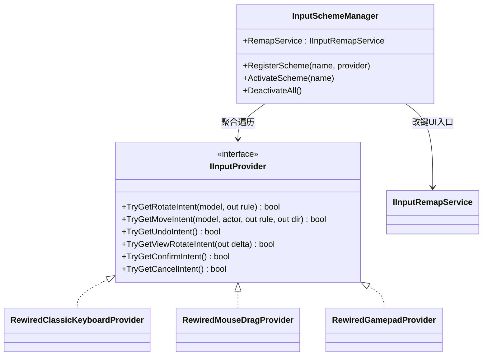

# Game Design Document: 玩家操控与交互系统

> **系统：** Player Input, View Rotation & Undo  
> **版本：** 3.1  
> **设计：** Game Designer + UX Designer  
> **最后更新**：2026-04-23（引入左键背景旋转 / 拖拽无缝交接 / 弹性阻尼防错）

---

## 1. 操控方案 (Input System)

### 1.1 架构概览

输入系统采用 **IInputProvider + InputSchemeManager** 解耦架构：

- `IInputProvider`：输入意图抽象接口，定义 6 种意图查询（旋转/移动/撤回/视角/确认/取消）
- `InputSchemeManager`：方案注册、激活管理和优先级聚合
- 游戏逻辑层（`TowerCenterSys` / `GateCenterSys`）**只通过 `IInputProvider` 查询玩家意图**，不感知具体输入设备

### 1.2 输入方案总览

| 方案 | 注册名 | 默认激活 | 说明 |
| :--- | :--- | :---: | :--- |
| 键盘方案 | `Keyboard` | ✅ | WASD 旋转 + 方向键移动 + Q/E 视角 + B 撤回 |
| 鼠标拖拽 | `MouseDrag` | ✅ | 左键旋转 + 右键寻路 + 中键视角 + Ctrl+Z |
| 手柄 | `Gamepad` | ✅ | 摇杆移动 + 十字键旋转 + LB/RB 视角 + A/B/X 系统键 |

**全局操作面约束（Consistency Rule）**：
所有操作方式均只能操作当前视角下**最外层的 4 个面（上/下/左/右）**，禁止操作中间层。
* 键盘/手柄：WASD / D-Pad 固定映射最外层（顶层/底层/左列/右列）。
* 鼠标：Raycast 命中面法线与摄像机朝向夹角 > 90 度时不响应（背面/底面自动剔除）。侧面拖拽按上下半区对齐到顶层/底层。

**设备共存策略**：
* **键盘 + 鼠标**：始终共存，互不干扰。PC 玩家左手键盘 + 右手鼠标是天然操作姿态。
* **手柄**：与键鼠互斥。插入手柄时自动切换为手柄模式，禁用键盘和鼠标的旋转/移动功能；拔出或检测到键鼠输入时自动切回。

**优先级**：键鼠模式 `MouseDrag > Keyboard` | 手柄模式 `Gamepad`（独占）

### 1.3 键盘映射表

| 输入 | 功能 | Rewired Action | 说明 |
| :--- | :--- | :--- | :--- |
| **W / S** | 面旋转（顶/底） | `RotateTop` / `RotateBottom` | 旋转指定层 |
| **A / D** | 面旋转（左/右） | `RotateLeft` / `RotateRight` | 受 RotationStep 影响 |
| **Space** | 反向修饰键 | `ReverseModifier` | 按住时旋转方向取反 |
| **↑ ↓ ← →** | 角色移动 | `MoveForward/Back/Left/Right` | 方向受 RotationStep 映射 |
| **Q / E** | 场景视角旋转 | `ViewRotateLeft/Right` | 离散 90° 步进 |
| **B** | 撤回 | `Undo` | 撤回上一步操作 |
| **Enter** | 确认 | `Confirm` | 进入关卡等 |
| **Backspace** | 取消 | `Cancel` | 返回 |

### 1.4 鼠标方案映射表

#### 1.4.1 左键拖拽旋转（核心交互）

判定规则：**"点击定范围，拖拽定操作"**

1. 玩家点击塔身可见表面的方块
2. 拖拽开始后前 8-12 像素用于判断拖拽方向（水平 or 垂直），锁定后本次拖拽只沿该方向生效
3. 点击表面 + 拖拽方向共同决定旋转操作

**可见面过滤与无效拖拽阻尼（Rubber Banding）**：
- Raycast 命中面法线与摄像机朝向夹角 > 90 度时不响应，自动排除背面和底面。
- 当玩家试图拖拽被限制旋转的面（如尝试在中间层进行垂直拖拽等非法操作）时，拖拽依然生效但将呈现极大的**弹性阻尼感**（屏幕移动 100px 仅旋转极小角度），并在松手时快速回弹至 0°，以提供“该层被物理卡住”的明确防错反馈。

**视觉交接连贯性（Seamless Handoff）**：
拖拽结束且判定为有效旋转（超过 45° 阈值触发吸附）时，系统需将**当前的视觉旋转进度**（例如 98%）作为 `startProgress` 提交给动画系统。由动画系统接管剩余 2% 的播放，坚决避免“先瞬移回 0° 再重播 0°-90° 动画”的视觉断裂感。

**左键空白区域拖拽（场景视角交互）**：
若左键点击发生在塔身外的空白背景区域（Raycast 未命中模型），拖拽行为将自动映射为**场景视角旋转**（详见 2.2 节）。此设计旨在统一“拖拽 = 旋转”的心智模型，并用于主界面的关卡自由预览操作。

**点击侧面（左侧面 / 右侧面）**：

| 拖拽方向 | 旋转操作 | 层选择 | 等价键 |
| :--- | :--- | :--- | :--- |
| 水平拖拽（左右划） | Y 轴旋转（水平转盘） | 点击位置在侧面**上半区** -> 顶层 (maxY)；**下半区** -> 底层 (minY) | 上半=W，下半=S |
| 垂直拖拽（上下划） | 旋转该侧的最外列 | 始终为该侧面最外列 | 左侧=A，右侧=D |

**点击顶面**：

| 拖拽方向 | 旋转操作 | 层选择 | 等价键 |
| :--- | :--- | :--- | :--- |
| 任意方向 | Y 轴旋转顶层（水平转盘） | 始终为最顶层 (maxY) | W |

#### 1.4.2 其他鼠标操作

| 输入 | 功能 | 实现系统 |
| :--- | :--- | :--- |
| 右键点击 | BFS 寻路自动移动 | `ClickToMoveSys` |
| 左键拖拽（背景） | 场景视角旋转（离散步进） | `RewiredMouseDragProvider` (替换原中键逻辑) |
| 中键滚轮 | 视角缩放（预留） | 待定 |
| Ctrl+Z / Cmd+Z | 撤回 | `RewiredMouseDragProvider.TryGetUndoIntent` |

> 鼠标方案使用 `UnityEngine.Input`（非 Rewired），因为需要像素级坐标。

### 1.5 手柄方案映射表

| 输入 | 功能 | Rewired Action | 说明 |
| :--- | :--- | :--- | :--- |
| 左摇杆 | 角色移动 | `MoveHorizontal` / `MoveVertical` (Axis) | 死区 0.3 + 4 方向离散化 + 防连发 |
| D-Pad 上/下/左/右 | 面旋转 | `RotateTop/Bottom/Left/Right` | 与键盘 WASD 一致 |
| LB / RB | 视角旋转 | `ViewRotateLeft/Right` | 与 Q/E 一致 |
| RT | 反向修饰键 | `ReverseModifier` | 与 Space 一致 |
| A（南键） | 确认 | `Confirm` | |
| B（东键） | 撤回 | `Undo` | |
| X（西键） | 取消 | `Cancel` | |

### 1.6 改键系统（接口预留）

`IInputRemapService` 接口已定义，当前未实现。提供：
- `GetAllBindings()` / `GetCurrentBinding()` — 查询绑定
- `StartListeningForRemap()` / `CancelListening()` — 改键监听
- `SaveBindings()` / `LoadBindings()` / `ResetToDefaults()` — 持久化
- `GetAvailableSchemes()` / `SetSchemeActive()` — 方案切换

通过 `InputSchemeManager.RemapService` 注入，改键 UI 开发后接入。

### 1.7 视角旋转上下文

- `TowerCenterSys` 和 `GateCenterSys` 各自维护独立的 `RotationStep`
- 所有输入方案通过 `IViewRotationContext` 消费 RotationStep
- QE / LB·RB / 中键拖拽 均修改 RotationStep，移动方向随之自动映射

---

## 2. 视角系统 (View Rotation)

### 2.1 核心原则

> **视角旋转只负责输入映射与视觉表现，不进入求解状态。**

| 维度 | 视角旋转（Q/E/LB·RB/中键） | 面旋转（谜题操作） |
| :--- | :--- | :--- |
| 逻辑影响 | 仅改变方向键映射 | 改变方块几何位置 |
| 求解状态 | 不影响 | 构成谜题解的一部分 |
| 回放/验证 | 不参与 | 参与 |
| DDA监测 | 作为 `ViewRotationActions` 统计 | 计入 `TotalActions` |

### 2.2 视角旋转触发方式

| 输入设备 | 触发方式 | 行为 |
| :--- | :--- | :--- |
| 键盘 | Q / E 键 | 离散 90° 步进 |
| 手柄 | LB / RB | 离散 90° 步进 |
| 鼠标 | 左键空白背景水平拖拽 > 80px | 离散 90° 步进 |

### 2.3 视角旋转成本指标

`ViewRotationActions` 当前定位为**统计/调参项**，不进入首窗 acceptance gate：

- 记录"玩家为了理解场景用了多少次旋转"
- 不直接决定关卡是否合格
- 若太早纳入硬约束，会把"场景理解成本"和"逻辑可解性"混在一起

---

## 3. 角色移动 (Player Movement)

### 3.1 移动规则

- 玩家角色在方块的**表面**行走
- 受重力方向 `GravityDir`、站位高度 `Height`、净空约束等规则控制
- 移动方向受视角旋转映射（`GetRotatedMoveDir`）

### 3.2 移动输入方式

| 输入设备 | 方式 | 说明 |
| :--- | :--- | :--- |
| 键盘 | 方向键 ↑↓←→ | 离散按键，每次按下移动一格 |
| 手柄 | 左摇杆 | 模拟量 → 死区过滤 → 4方向离散化 → 防连发 |
| 鼠标 | 右键点击目标方块 | BFS 寻路 → 路径队列 → 逐帧消费 |

### 3.3 移动类型

| 类型 | 说明 | 对应 Resolver |
| :--- | :--- | :--- |
| 水平移动 (Flat) | 同一高度的平面横移 | `FlatTraversalResolver` |
| 上楼 (StepUp) | 踏上楼梯块向上一层 | `StairTraversalResolver` |
| 下楼 (StepDown) | 从楼梯块向下一层 | `StairTraversalResolver` |
| 侧向楼梯 (StepSideways) | 楼梯的横向通行 | `StairTraversalResolver` |
| StepToStep | 楼梯间的连续通行 | `StairTraversalResolver` |

### 3.4 右键寻路（鼠标专用）

- `ClickToMoveSys`：右键点击方块 → Raycast 定位目标 → BFS 路径搜索 → 路径入队
- 路径失效时机：发生旋转 / 窗口切换 / 手动移动覆盖
- 路径步骤消费前校验起点坐标匹配，不匹配则清空路径

### 3.5 登顶判定

玩家到达当前窗口顶层触发 `ShiftWindowUp()`，条件：
- 玩家移动结束
- 玩家首次站上当前窗口顶层
- 当前不在动画锁和旋转锁中

---

## 4. 旋转安全系统 (Rotation Safety)

由 `RotationSafetyValidator` 实现：

| 约束 | 说明 |
| :--- | :--- |
| 玩家所在层不可旋转 | 防止玩家被旋转甩出 |
| 头顶扫掠空间安全 | 旋转过程中不能挤压到玩家 |

---

## 5. 撤回系统 (Undo)

### 5.1 机制规则

| 规则 | 说明 |
| :--- | :--- |
| 操作可撤回 | 玩家可撤回面旋转和移动操作 |
| 跨窗口清空 | 窗口切换时必须清空 Undo 历史 |
| 不可跨窗口撤回 | 防止状态错乱 |

### 5.2 撤回触发方式

| 输入设备 | 按键 | 说明 |
| :--- | :--- | :--- |
| 键盘 | B 键 | Rewired `Undo` Action |
| 鼠标 | Ctrl+Z / Cmd+Z | UnityEngine.Input 直接检测 |
| 手柄 | B / Circle | Rewired `Undo` Action |

### 5.3 DDA 信号

撤回行为是 DDA 系统最重要的行为信号：
- **撤回率**：作为 DDA 的**首位权重**行为指标
- 高撤回率 = 高挫败感 = 需要降低难度

---

## 6. 指标区分

| 指标 | 含义 | 用途 |
| :--- | :--- | :--- |
| `MaxTotalActions` | 语义动作预算 | 求解器/解法层面的动作上限 |
| `RawInputActions` | 真实按键成本 | 玩家操作成本统计，`RawInputActions >= MaxTotalActions` |
| `ViewRotationActions` | 视角旋转成本 | 统计/调参，不进入首窗 acceptance gate |

---

## 7. 技术实现文件清单

| 模块 | 文件 | 说明 |
| :--- | :--- | :--- |
| 抽象层 | `IInputProvider.cs` | 输入意图接口（6 个方法） |
| 抽象层 | `InputActions.cs` | Rewired Action 常量（28 个） |
| 抽象层 | `InputSchemeManager.cs` | 方案注册/激活/聚合 |
| 抽象层 | `IInputRemapService.cs` | 改键 UI 接口（11 个 API） |
| 键盘 | `RewiredClassicKeyboardProvider.cs` | 经典 WASD 方案 |
| 鼠标 | `RewiredMouseDragProvider.cs` | 左键旋转+右键移动+中键视角+Ctrl+Z |
| 鼠标 | `MouseDragContext.cs` | 拖拽状态数据 |
| 鼠标 | `MouseDragRotationSys.cs` | 拖拽旋转系统 |
| 鼠标 | `ClickToMoveSys.cs` | BFS 寻路系统 |
| 手柄 | `RewiredGamepadProvider.cs` | 摇杆+十字键+LB/RB/RT+A/B/X |

> 配置指南：`.agents/docs/guides/rewired-configuration-guide.md`
