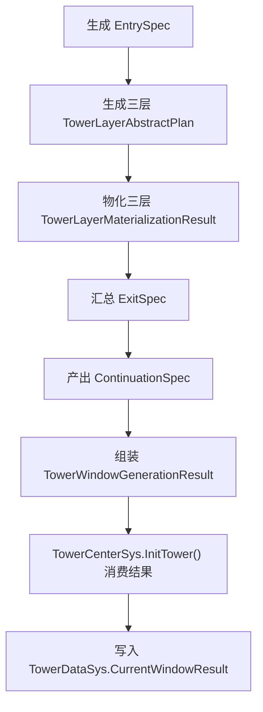
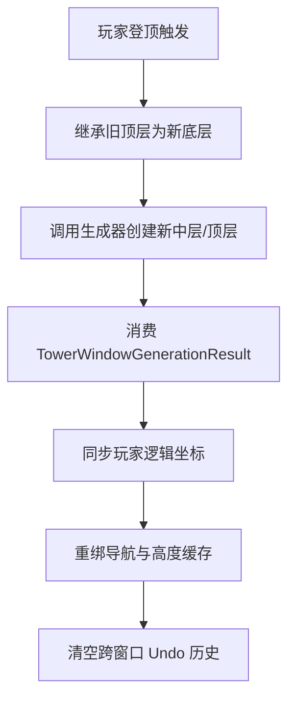

# Game Design Document: 塔系统与窗口语义

> **系统：** Tower Window, Continuation & Shift  
> **版本：** 1.2  
> **设计：** Game Designer

---

## 1. 窗口语义模型 (Window Semantics)

### 1.1 核心原则

> **`TowerWindowGenerationResult` 是窗口的唯一真源。**

每个窗口生成后，产出一个完整的 `TowerWindowGenerationResult`，所有运行时状态都围绕它初始化，不再围绕裸 `CubeModel` 自行猜语义。

### 1.2 窗口结果结构

| 字段 | 类型 | 说明 |
| :--- | :--- | :--- |
| `Model` | `CubeModel` | 窗口的完整方块模型（3×3×3 slot 宇宙） |
| `EntrySpec` | `TowerEntrySpec` | 入口语义：玩家落点 + 底层入口位置 |
| `ExitSpec` | `TowerExitSpec` | 出口语义：顶层出口位置 + 续关信息 |
| `BottomLayer` | `TowerLayerMaterializationResult` | 底层物化结果 |
| `MiddleLayer` | `TowerLayerMaterializationResult` | 中层物化结果 |
| `TopLayer` | `TowerLayerMaterializationResult` | 顶层物化结果 |
| `ContinuationSpec` | `TowerContinuationSpec` | 续关规范 |
| `PrimaryBottomPath` | `逻辑坐标序列` | 底层显式主路径 |
| `PrimaryBottomSourceCoord` | `Vector3Int` | 底层主路径源坐标 |
| `Seed` | `int` | 生成种子 |
| `SegmentId` | `int` | 段落配置ID |

### 1.3 窗口生成流程



---

## 2. 续关机制 (Continuation)

### 2.1 续关真源

> **`ContinuationSpec.NextEntrySpec` 是下一窗口入口的唯一主真源。**

| 字段 | 职责 |
| :--- | :--- |
| `NextEntrySpec` | 决定下一窗口入口（主真源） |
| `ContinuationHints` | 辅助锚点提示（不主导入口推导） |

- 旧 heuristic anchor fallback 仅保留兼容路径，默认关闭
- 任何"旧 hints 主导入口"的逻辑降级为兼容分支，并记录 `LegacyFallbackUsed` 诊断日志

### 2.2 唯一续关投影入口

```csharp
TryProjectTopLayerToNextBottom(
    上一窗口顶层结果,
    TowerContinuationSpec
) → (下一窗口底层 EntrySpec, 物化结果, 失败码)
```

- 真实滑窗与批量验证**都必须调用同一个入口**
- 任何 next-window 构造都不能绕过它

### 2.3 续关安全性前移

> **不做整窗后置拦截，改为出口模块前瞻筛选。**

`ExitSpec` 候选进入池前必须满足三个条件：
1. 当前层 `Entry → Exit` 成立
2. `Exit.NextEntrySpec` 可投影成下一层合法入口
3. 下一层至少存在一个合法 `ExitSpec` 候选

---

## 3. 滑窗机制 (ShiftWindowUp)

### 3.1 滑窗流程



### 3.2 滑窗契约

| 步骤 | 说明 |
| :--- | :--- |
| 继承 | 旧顶层原样继承为新底层 |
| 生成 | 消费 `TowerWindowGenerationResult`，不再"补两层普通块" |
| 同步 | 更新 `TowerDataSys.CurrentWindowResult`、玩家逻辑坐标 |
| 导航 | 重建导航绑定、`ToHeight` 相关缓存 |
| Undo | 清空跨窗口撤回历史，防止跨窗口撤销 |

### 3.3 旋转继承规则 (v1.1)

> **核心约束**：续窗时新 Root **必须继承旧 Root 的 QE 场景旋转角度**。

| 规则 | 说明 |
| :--- | :--- |
| 旋转继承 | 新 `BuildLevelRoot` 传入 `Euler(0, RotationStep * 90, 0)`，不可传 `identity` |
| 上下文保持 | `_viewRotationContext` 不重置，保证输入映射与视觉朝向同步 |
| Re-parent | 旧顶层格子必须用 `SetParent(false)` + 显式 `localPosition` 赋值，禁止 `worldPositionStays=true` |
| 玩家挂载 | 同理使用 `SetParent(false)` + 显式 `localPosition/localRotation`，避免世界坐标换算漂移 |
| 决策重建 | `RotateKeyDecision` 和 `MoveKeyDecision` 必须重建以绑定新 `_model` |

### 3.4 出口检测模式 (v1.2)

> **核心架构**：`TowerExitSpec.CheckMode` 决定续窗/通关触发条件，支持不同游戏模式的差异化需求。

| 模式 | 枚举值 | 触发条件 | 适用场景 |
| :--- | :--- | :--- | :--- |
| 精确坐标 | `GoalCheckMode.ExactCoord` | `StandCoord == ExitSpec.Coord` | GateState 关卡模式、动态生成关卡 |
| 顶层模糊 | `GoalCheckMode.TopLayerAny` | `StandCoord.y == 1` + `IsFlatBlock` + `CanActorStandAt` | TowerState 无尽塔模式 |

**设计决策**：
- 默认值 `ExactCoord`，向后兼容 GateState 现有流程
- 无尽塔生成器（续窗 + 首窗）设置 `TopLayerAny`
- `TopLayerAny` 必须排除楼梯块（`IsFlatBlock`）：楼梯逻辑坐标在 Y=1 但玩家实际还在爬升中
- 非标出口的续关由 `CaptureContinuationSpecFromLive` 基于玩家实际 `StandCoord` 捕获，无需额外处理

---

## 4. Family 系统

### 4.1 当前状态

| 项 | 值 |
| :--- | :--- |
| 唯一首窗 Family | `SpineClimbFamily` |
| 唯一模板 | `SpineClimbTemplate01`（保守模板） |
| slot 宇宙 | 保留完整 3×3×3，不破坏旋转/视图/CoordConverter假设 |
| 空位实现 | 保留 slot、不给 block（`BlockId=0`，`BlockModelInfo=null`） |

### 4.2 空位规则

> **不得用 `BlockType.Void + 同模型` 伪装空位**，因为现有视图层不会自动跳过渲染。

### 4.3 扩展规划 (阶段D)

- 把 `SpineClimb` 从单模板扩展为小模板池
- 引入 richer middle/top pattern
- 多 family 扩展
- 模板池权重与 collapse 监控

---

## 5. 游戏模式对比

| 维度 | GateState（关卡模式） | TowerState（无尽塔模式） |
| :--- | :--- | :--- |
| 定位 | 新手教学 + 精品关卡 | 核心玩法，长线体验 |
| 数据来源 | 配置表手工填写 | PCG + 反向打乱生成 |
| 难度控制 | 策划直接控制 | DDA 实时调控 |
| 可见范围 | 固定关卡 | 始终3层滑窗 |
| 进度 | 星级评价 | 无尽攀升高度 |
| 改造范围 | 独立，不在塔系统范围内 | 核心改造对象 |
