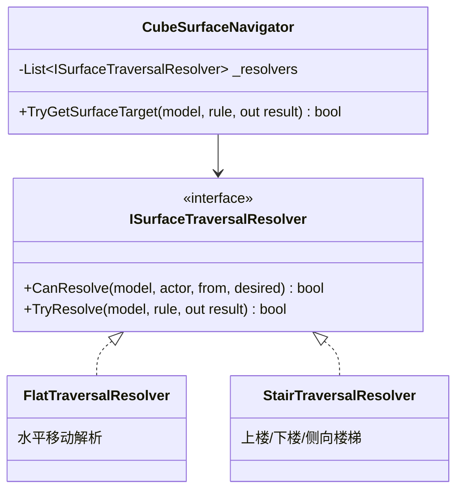

# Game Design Document: 方块类型与地块规则

> **系统：** Block Types, Surface Navigation & Traversal Rules  
> **版本：** 1.0  
> **设计：** Game Designer

---

## 1. 方块分类 (Block Types)

### 1.1 当前已实现

| 类型 | 说明 | 可站立 | 可通行方向 |
| :--- | :--- | :--- | :--- |
| **平面块 (Flat)** | 标准方块，表面平坦 | ✓ | 水平四向 |
| **楼梯块 (Stair)** | 带台阶结构，连接上下层级 | ✓ | 上/下/侧向 |
| **空位 (Void)** | 无方块，保留slot | ✗ | 不可通行 |

### 1.2 空位实现规则

> **空位 = "保留 slot、不给 block"**

| 字段 | 值 |
| :--- | :--- |
| `BlockId` | 0 |
| `BlockModelInfo` | null |
| 视图层 | 不渲染（CubeViewFactorySys 跳过） |

**禁止**：用 `BlockType.Void + 同模型` 伪装空位，因为现有视图层不会自动隐藏 block。

### 1.3 方块模型解析优先级

从配置链 `TowerSegmentRule → TowerBlockPool → TbBlockModel` 解析：

1. 优先解析首个可用 **flat-capable** 模型（用于平面着陆）
2. 优先解析首个可用 **step-capable** 模型（用于楼梯通行）
3. 若解析不到 step-capable → 中止并返回 `TemplateResolutionFailed`
4. 若解析不到 block pool → 允许 fallback 到已知 `1001` 模型（仅用于 flat landing）

---

## 2. 表面导航系统 (CubeSurfaceNavigator)

### 2.1 规则调度器架构

`CubeSurfaceNavigator` 从硬编码判断改造为**规则调度器**，通过注册 Resolver 支持新地块：



### 2.2 解析流程

```csharp
public static bool TryGetSurfaceTarget(CubeModel model, MoveRule rule, 
                                        out SurfaceMoveResult result)
{
    foreach (var resolver in _resolvers)
    {
        if (resolver.CanResolve(model, rule.Actor, rule.From, rule.To) &&
            resolver.TryResolve(model, rule, out result))
        {
            return true;
        }
    }
    result = default;
    return false;
}
```

### 2.3 已注册 Resolver

| Resolver | 处理类型 | 说明 |
| :--- | :--- | :--- |
| `FlatTraversalResolver` | 平面移动 | 同层水平四向移动 |
| `StairTraversalResolver` | 楼梯通行 | StepUp / StepDown / StepSideways / StepToStep |

### 2.4 扩展方式

新增地块只需：
1. 新增一个 `ISurfaceTraversalResolver` 实现
2. 注册到 `_resolvers` 列表
3. 不需要修改生成器或求解器主体

---

## 3. 楼梯系统 (Stair Mechanics)

### 3.1 楼梯通行模式

| 模式 | 说明 | 实现阶段 |
| :--- | :--- | :--- |
| **StepUp** | 从低层踏上楼梯块向上一层 | 基础 |
| **StepDown** | 从高层经楼梯块向下一层 | 基础 |
| **StepSideways** | 楼梯的横向通行 | 3.7扩展 |
| **StepToStep** | 楼梯间的连续通行 | 3.7扩展 |

### 3.2 已完成的修复

| 修复项 | 内容 |
| :--- | :--- |
| 楼梯语义修复 | 统一楼梯的逻辑判定 |
| 楼梯表现旋转修复 | 修正旋转后楼梯视觉朝向 |
| 楼梯路径首尾点统一 | 路径节点对齐 |

---

## 4. 面几何与通行能力

生成器使用 `FaceInfo` / `FaceGeometryType` / `FaceTraversalType` 判定通行能力，**而非只看 `BlockType`**。

| 概念 | 说明 |
| :--- | :--- |
| `FaceInfo` | 方块某个面的信息 |
| `FaceGeometryType` | 面的几何类型（平面/斜面等） |
| `FaceTraversalType` | 面的通行类型（可走/不可走/单向等） |

---

## 5. 站位与净空

### 5.1 玩家站位口径

阶段 3.7 统一了全局站位口径：

| 参数 | 说明 |
| :--- | :--- |
| `StandCoord` | 玩家逻辑站位坐标 （Vector3Int） |
| `Height` | 站位高度 |
| `ToHeight` | 目标高度缓存 |
| `GravityDir` | 重力方向 |

### 5.2 净空约束

| 约束 | 说明 |
| :--- | :--- |
| Headroom | 玩家头顶上方必须无遮挡 |
| 楼梯净空 | 楼梯通行路径上方必须有足够空间 |
| 旋转扫掠净空 | 旋转操作的扫掠路径上不能挤压玩家 |
