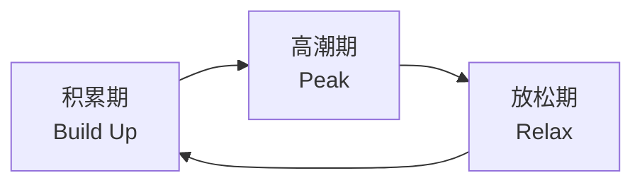

# Game Design Document: 动态难度调整与心流系统

> **系统：** Dynamic Difficulty Adjustment (DDA) & Flow Theory  
> **版本：** 1.0  
> **设计：** Game Designer

---

## 1. 理论框架

### 1.1 核心目标

> **通过实时调控使玩家始终处于"心流通道"（Flow Channel）。**

基于 Csikszentmihalyi 心流理论，当游戏挑战与玩家技能精确匹配时，玩家进入深度沉浸的心流状态。DDA 系统的本质是一个**最优化求解器**。

### 1.2 挑战-技能平衡比率方程（CSR）

$$CSR = \frac{C(M)}{S(t)}$$

| 符号 | 含义 |
| :--- | :--- |
| $C(M) = \alpha \cdot e^{\beta M}$ | 挑战函数，随打乱步数 M 指数增长 |
| $S(t)$ | 玩家技能评估值，通过行为指标动态更新 |
| $\alpha, \beta$ | 系统标定常数 |

### 1.3 状态判定

| 状态 | CSR 条件 | 玩家体验 | DDA 响应 |
| :--- | :--- | :--- | :--- |
| **心流** | $CSR \approx 1.04$ | 最佳沉浸 | 维持当前参数 |
| **焦虑** | $CSR \gg 1.04$ | 挫败、流失风险高 | 降低 M |
| **无聊** | $CSR < 1.0$ | 缺乏刺激 | 提升 M |

> **4% 法则**：当任务挑战刚好比玩家当前技能高出约 4% 时，最容易触发深度心流。

---

## 2. 行为监测指标

### 2.1 指标定义

| 指标 | 内部表示 | 含义 | 权重定位 |
| :--- | :--- | :--- | :--- |
| **撤回率** | `UndoRate` | 空间规划与预期结果的偏差度 | **核心权重**（最直接的挫败信号） |
| **停顿时间** | `IdleTime` | 无有效操作的观察思考时长 | 认知超载预警 |
| **单层耗时** | — | 完成当前层所用总时间 | 综合难度衡量 |
| **无效步数** | — | 不推进解题进度的操作数 | 盲目试错度 |

### 2.2 行为组合判定矩阵

| 组合模式 | 判定结论 | DDA 干预 |
| :--- | :--- | :--- |
| **高撤回 + 短停顿** | 焦躁盲目试错（高度焦虑） | 立即降低 M，增加引导 |
| **高停顿 + 零星撤回** | 认知停滞（深度挫败） | 降低 M，减少复合轴旋转，增加主轴引导 |
| **低耗时 + 零撤回** | 过于简单（无聊） | 提升 M，增加交互方块 |
| **中撤回 + 中耗时** | 健康挑战（心流） | 维持，微调 |

### 2.3 技能评估函数

```
玩家在第 t 层的表现向量 X_t = { 撤回率, 无效步数, 单层耗时 }
技能评估值 S(t) = 加权移动平均 或 卡尔曼滤波更新
```

---

## 3. 认知超载监测

### 3.1 多维度判定

| 维度 | 方法 | 说明 |
| :--- | :--- | :--- |
| 经验阈值 | 基准时间（如5秒闲置） | 预测试观察标定 |
| 模糊逻辑 | Very Fast / Fast / Slow / Very Slow | 柔性分级，适应个体差异 |
| 行为画像 | 停顿时长 × 撤回频率 | 交叉验证认知状态 |
| 空间僵局模型 | 短停顿=困惑（有益） / 长停顿=挫败（有害） | 心理学理论关联 |

### 3.2 "站立不动时间"的认知映射

研究表明，"玩家静止站立的时间"是预测挫败和焦虑状态的**强正相关特征**。

- 短时间停顿 → **困惑（Confusion）**：有益认知状态，玩家在假设测试
- 长时间停顿越过阈值 → **挫败（Frustration）**：认知超载，需要干预

---

## 4. 宏观心流与戏剧节奏

### 4.1 波浪形节奏

> **无尽塔不能一味推高难度。**



| 阶段 | 打乱步数 | 玩家体验 |
| :--- | :--- | :--- |
| **积累期** | 中等 M | 稳步提升信心 |
| **高潮期** | 高 M | 紧张刺激的挑战 |
| **放松期** | 极低 M 或奖励层 | 释放压力、回收资源 |

### 4.2 自适应戏剧节奏规则

- 监测到玩家刚经历高耗时、高撤回的"高潮层"后
- 下一层**强制进入放松期**
- 放松期可生成：打乱步数极小的简单层 / 环境叙事层 / 增益道具层

---

## 5. DDA 最优化干预模型

### 5.1 马尔可夫决策过程（MDP）

将"维持心流"转化为**最大化玩家参与度**的数学优化问题。

玩家在第 k 层只有三种走向：

| 走向 | 概率 |
| :--- | :--- |
| 胜利并进入下一层 | $w(M) \times (1 - c^W)$ |
| 失败并卡关/重试 | $(1 - w(M)) \times (1 - c^L)$ |
| 流失（退出游戏） | $c^W$ 或 $c^L$ |

### 5.2 贝尔曼状态转移方程

$$R_k(M) = w(M)(1 - c^W) \cdot R_{k+1} + (1 - w(M))(1 - c^L) \cdot R_{k} + 1$$

| 符号 | 含义 |
| :--- | :--- |
| $w(M)$ | 当前打乱步数 M 下的预估通关概率 |
| $c^W$ | 因关卡**太简单**（无聊）而通关后退出的概率 |
| $c^L$ | 因关卡**太难**（焦虑）而失败后退出的概率 |
| $R_k(M)$ | 期望总层数（最大化目标） |

### 5.3 最终结论

DDA 系统通过预测玩家当前技能 $S(t)$，求解最佳打乱步数 $M^*$，使得：

$$C(M^*) \approx S(t) \times 1.04$$

从而在数学层面锁住玩家的心流通道。

---

## 6. 技术接口

### 6.1 DDA Provider

```csharp
public interface ITowerDdaProvider
{
    TowerDifficultyProfile GetProfile(TowerDdaContext context);
}

public sealed class TowerDdaContext
{
    public int UndoCount;
    public float IdleTime;
    public int RecentFailCount;
    public int AbsoluteClimbHeight;
    public int SegmentId;
}

public readonly record struct TowerDifficultyProfile(
    int TargetRotateDepthMin,
    int TargetRotateDepthMax,
    int MaxTotalActions,
    int MaxMoveActions,
    int RetryLimit,
    int SolverNodeCap);
```

### 6.2 当前实现

`StaticTowerDdaProvider`：从配置表读取固定 profile，不实现完整动态闭环。

```csharp
public sealed class StaticTowerDdaProvider : ITowerDdaProvider
{
    public TowerDifficultyProfile GetProfile(TowerDdaContext context)
    {
        var rule = Cfg.Tables.TbTowerSegmentRule.Get(context.SegmentId);
        return new TowerDifficultyProfile(
            rule.TargetRotateDepthMin,
            rule.TargetRotateDepthMax,
            rule.MaxTotalActions,
            rule.MaxMoveActions,
            rule.RetryLimit,
            rule.SolverNodeCap);
    }
}
```

### 6.3 扩展路径

后续接入完整 DDA 时：
- 只需更换 Provider 实现
- 补充上下文采集（UndoCount、IdleTime 等）
- **不需要重写生成器**

### 6.4 远期规划条目

#### 6.4.1 配置表双层架构（E.1 → E.2）

配置表提供"基线 + 硬约束边界"，DDA Provider 在边界内做个性化微调：
- `ScrambleStepCount`：默认值 / 冷启动值
- `ScrambleStepCountMin`：DDA 允许的最小 M
- `ScrambleStepCountMax`：DDA 允许的最大 M
- DDA 输出：`M* = Clamp(CSR_solve(S(t)), MMin, MMax)`

#### 6.4.2 方案 B 对 CSR 方程的影响

当 ContinuationSpec 改为基于打乱后状态生成（方案 B）时：
- 挑战函数 $C(M)$ 需要考虑续窗底层的打乱贡献
- 续窗的"等效难度"不再仅由本窗打乱步数 M 决定，还需加权上一窗口的残余打乱影响
- 需要扩展 CSR 方程为：$CSR = \frac{C(M) + \lambda \cdot C_{carry}}{S(t)}$，其中 $C_{carry}$ 为上一窗口续关投影带来的额外挑战

#### 6.4.3 混合打乱对难度评估的影响

引入玩家移动打乱后：
- 打乱步数 M 不再是纯旋转步数，而是旋转 + 移动的混合步数
- 移动步骤的认知负荷通常低于旋转步骤
- 需要引入加权步数：$M_{eff} = M_{rotate} + \gamma \cdot M_{move}$，其中 $\gamma < 1$（如 $\gamma = 0.5$）
- `ScrambleMoveWeight` 间接影响 $M_{eff}$ 的期望值

