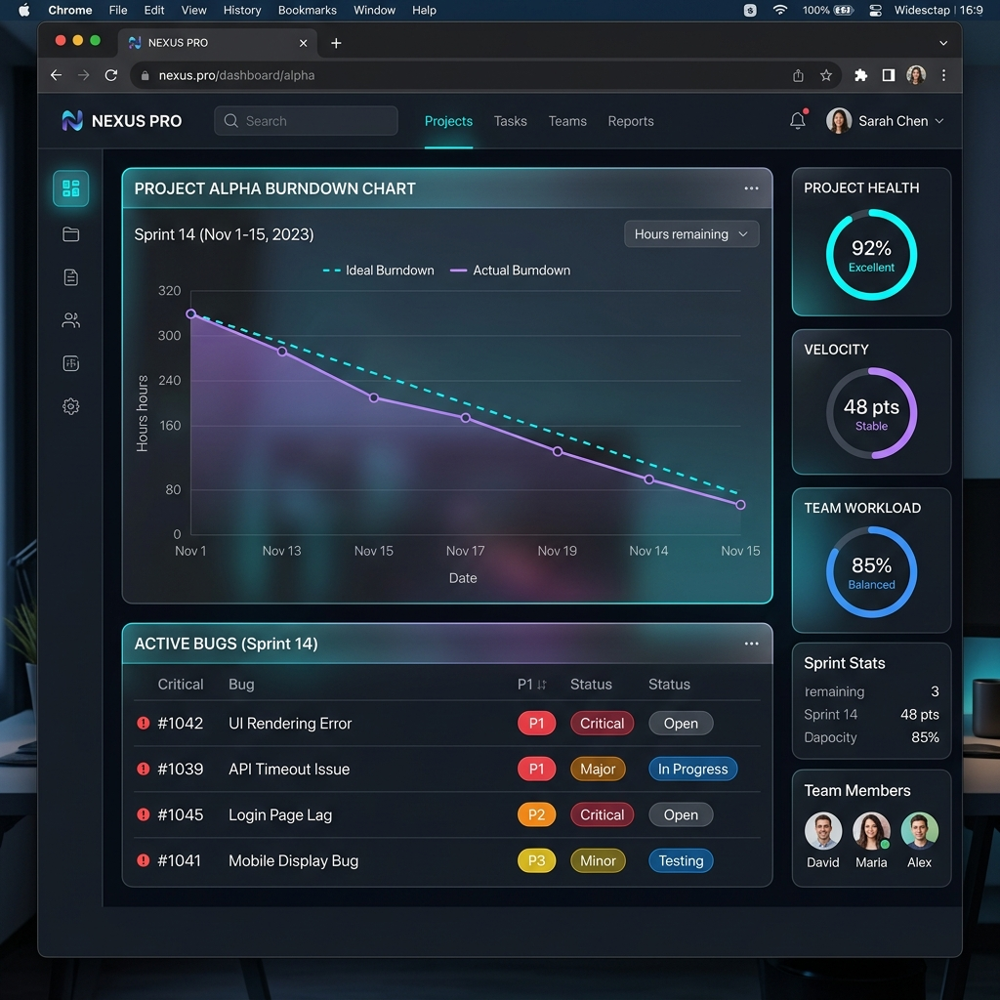

# CCGS 迭代计划 004：轻量级项目状态大屏 (可视化降维)

> **制定时间**：2026-04-27
> **参与专家**：UX Designer, Art Director, Technical Artist
> **计划目标**：打破纯文本文件夹的浏览局限，通过极简 Python 脚本与前端技术，为 CCGS 框架挂载一个极具“WOW”体验的全局状态可视化仪表盘。

## 一、 现状痛点与重构愿景 (Pain Points & Vision)
目前所有的状态流转（Sprint 进度、门禁状态、QA Bug）都以 Markdown 或 YAML 形式躺在文件夹里。制作人或开发者需要逐个打开文件才能建立全局认知，缺乏“一目了然”的掌控感。
我们希望实现**可视化降维**：一条命令 `/dashboard`，即可在浏览器中拉起一张极简且极具视觉冲击力的状态大屏。

---

## 二、 跨领域专家联合设计方案 (Expert Co-Design)

### 🎨 1. 艺术总监 (Art Director) 的视觉定调
> “第一眼的 WOW 体验来源于色彩张力与材质的呼吸感。坚决摒弃简陋的后台面板感，我们要打造的是赛博敏捷（Cyber-Agile）美学。”
- **基础色调**：采用深岩灰 (Deep Slate `#0F172A`) 作为全局暗黑背景，提供沉浸式体验。
- **高亮强调色**：运用霓虹青 (Neon Cyan `#06B6D4`) 描绘燃尽图进度，霓虹紫 (Neon Purple `#8B5CF6`) 高亮 Bug 状态。
- **材质表现**：全面采用**毛玻璃效果 (Glassmorphism)**，利用半透明背板与 Subtle 投影，让数据卡片仿佛悬浮在终端之上。

### 📐 2. 交互设计师 (UX Designer) 的布局流
> “开发者的视线扫视是‘F型’的，我们要把最焦虑的数据放在视觉落点。”
- **核心 C 位（左上）**：放置 Sprint 燃尽图 (Burn-down Chart)，结合我们现有的 YAML 状态数据计算剩余点数。
- **健康雷达（右侧）**：提供各个文件模块的健康度（如 `ui-framework`，`backend-api`）的环形进度条，直观反映 TODO 和 FIXME 的密度。
- **异常警报（左下）**：列出活跃状态的 Bug 列表，用红黄等色块标识 High/Medium 优先级。

### 🛠 3. 技术美术 (Technical Artist) 的轻量化管线
> “为了保持 CCGS 框架的通用与轻盈，我们绝不能引入庞大的 Node.js 框架。KISS 原则是底线。”
- **后端架构**：在 `.ccgs-core/scripts/` 中编写一个无依赖的 `dashboard.py`。它负责遍历 `CCGS-Data` 下的 Markdowns，通过正则或解析 YAML 头部提取出统计数据。
- **前端渲染**：写死一个优雅的 `index.html`，纯手工搓出 Vanilla CSS 变量与 Glassmorphism 样式。数据通过 Python 注入到 HTML 的 `<script>` 标签内的常量中。
- **拉起方式**：利用 Python 内置的 `http.server` 在内存中起服，并自动打开默认浏览器访问 `localhost:8080`。

---

## 三、 视觉原型预览 (Visual Prototype)
基于上述专家的联合构思，这是我们为你生成的大屏视觉概念原型图：

---

## 四、 实施路径规划 (Implementation Path)
1. **数据解析层开发**：编写 `dashboard.py`，加入读取 `sprint-status.yaml`、聚合 Bug 标签、统计 TODO/FIXME 的逻辑。
2. **样式组件库搭建**：在 `index.html` 中建立全局 CSS Token，编写环形进度条与毛玻璃卡片的 CSS 代码。
3. **工作流集成**：在 `.ccgs-core/workflows/skills/` 新增 `dashboard` 技能流，让任何人敲入 `/dashboard` 就能一键生成最新数据并拉起网页。
